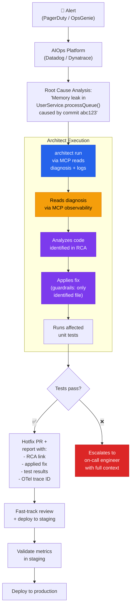

# AIOps Incident Code Remediation

> Alert → AIOps diagnoses root cause → architect applies code hotfix → PR with full traceability.

## The problem

The 2026 Agentic SRE paradigm has 3 layers: data plane (telemetry), reasoning layer (diagnosis), and action layer (remediation). AIOps platforms — Dynatrace, PagerDuty, Datadog — cover the first two. The third, writing and deploying corrective code, is where most fail. The diagnosis says "memory leak in UserService.processQueue() caused by commit abc123" but nobody writes the fix automatically.

## Where architect fits in

Architect is the **action layer** that takes the AIOps diagnosis and turns it into a code fix. It receives context via MCP (connected to the observability platform), applies the fix with strict production guardrails, and generates a report for the post-mortem with a complete OTel trace.

## Diagram



## Implementation

### Configuration

```yaml
# .architect.yaml
llm:
  model: openai/gpt-4.1
  api_key_env: OPENAI_API_KEY

mcp:
  servers:
    - name: datadog
      url: http://datadog-mcp-bridge:8082/mcp
      auth:
        type: bearer
        token_env: DD_MCP_TOKEN

guardrails:
  max_files_modified: 3    # Hotfix = surgical change
  protected_files:
    - "*.env*"
    - "config/production.*"
    - "k8s/production/**"
    - "Dockerfile*"
    - "*.lock"
  blocked_commands:
    - "kubectl apply"
    - "docker push"
    - "npm publish"
    - "terraform apply"

costs:
  budget_usd: 1.00  # Hard limit per incident

telemetry:
  enabled: true
  exporter: otlp
  endpoint: http://otel-collector:4317
```

### Integration script

```bash
#!/bin/bash
# incident-autofix.sh — called by PagerDuty webhook

INCIDENT_ID=$1
RCA_SUMMARY=$2

architect run \
  "A production incident has been diagnosed. \
   Incident ID: ${INCIDENT_ID}. \
   Root cause: ${RCA_SUMMARY}. \
   Read the detailed incident logs via MCP (tool: get_incident_logs). \
   Identify the affected file and function. \
   Apply the MINIMAL fix needed. \
   Run only the tests for the affected module." \
  --config .architect.yaml \
  --confirm-mode yolo \
  --budget 1.00 \
  --report-file "incidents/${INCIDENT_ID}-report.json"

EXIT_CODE=$?

if [ $EXIT_CODE -eq 0 ]; then
  git checkout -b "hotfix/${INCIDENT_ID}"
  git add -A
  git commit -m "hotfix(${INCIDENT_ID}): auto-remediation via architect"
  git push -u origin "hotfix/${INCIDENT_ID}"
  gh pr create \
    --title "🚨 hotfix(${INCIDENT_ID}): auto-remediation" \
    --body "$(cat incidents/${INCIDENT_ID}-report.json)" \
    --label "hotfix,auto-generated"
fi
```

## Architect features used

| Feature | Role in this architecture |
|---------|--------------------------|
| **MCP** | Reads diagnosis and logs from the AIOps platform |
| **run** | Single execution: one incident, one fix |
| **Guardrails** | Ultra-strict: max 3 files, blocks deploy commands |
| **Budget** | $1.00 hard limit per incident |
| **OTel** | Execution trace ID linkable to the incident |
| **Reports** | Complete JSON for the post-mortem |

## Guardrails are critical here

In a production incident context, guardrails are not optional — they are the difference between "agent fixes the bug" and "agent takes down production". This is why:

- `max_files_modified: 3` — a hotfix touches 1-2 files, never 10
- `blocked_commands` — the agent cannot deploy, only write code
- `protected_files` — production configs are untouchable
- `budget_usd: 1.00` — if the fix does not work in ~3-5 LLM calls, escalate to a human
