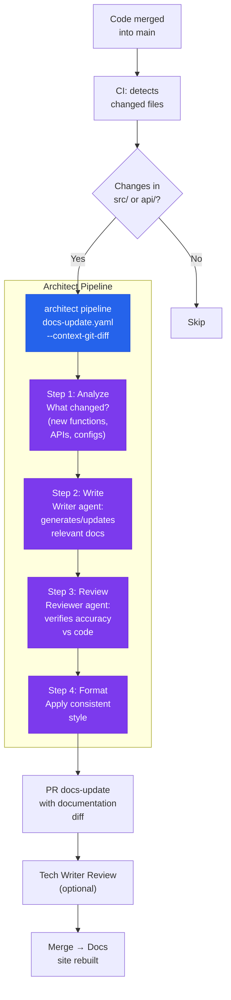

# Documentation-as-Code Pipeline

> Code merged → architect reads git diff → Writer generates docs → Reviewer verifies → docs PR.

## The problem

Documentation becomes outdated the day after it is written. Teams know they need to keep it current but do not have the time. The result: a README.md from 2 years ago, API docs that do not match the code, and painful onboarding for new team members.

## Where architect fits in

Architect as a **post-merge pipeline** that reads the changes (git diff), generates/updates relevant documentation, and creates a docs PR. It does not replace human-written documentation — it keeps it synchronized with the code using the Writer/Reviewer pattern with sub-agents.

## Diagram



## Implementation

### Pipeline YAML with Writer/Reviewer

```yaml
# docs-update.yaml
name: docs-sync
steps:
  - name: analyze-changes
    agent: build
    task: >
      Analyze the git diff from the latest merge to main.
      Identify: new public functions, API changes,
      new configuration files, dependency changes.
      Generate DOCS_PLAN.md with documentation sections to update.
      Only include changes relevant to users — ignore internal refactors.

  - name: write-docs
    agent: build
    task: >
      Following DOCS_PLAN.md, update the existing documentation.
      If there are new functions, add docstrings and update the API reference.
      If there are new configs, document them in the configuration guide.
      If there are new endpoints, update the API reference with examples.
      Maintain the tone and style of the existing documentation.

  - name: review-docs
    agent: reviewer
    task: >
      Review the documentation generated in the previous step.
      Verify that each code example is correct.
      Verify that the documented types and parameters match
      the actual code (read the source files).
      If you find inconsistencies, note them in REVIEW_NOTES.md
      and fix those you can.

  - name: format
    agent: build
    task: >
      Apply consistent formatting to all modified .md files.
      Verify that internal links are not broken.
      Run markdownlint if available.
```

### GitHub Actions workflow

```yaml
# .github/workflows/docs-sync.yml
name: Docs Sync
on:
  push:
    branches: [main]
    paths:
      - 'src/**'
      - 'api/**'
      - 'config/**'

jobs:
  docs:
    runs-on: ubuntu-latest
    steps:
      - uses: actions/checkout@v4
        with:
          fetch-depth: 2  # For git diff

      - name: Update docs
        run: |
          architect pipeline docs-update.yaml \
            --config .architect.yaml \
            --confirm-mode yolo \
            --context-git-diff HEAD~1 \
            --budget 0.30
        env:
          OPENAI_API_KEY: ${{ secrets.LLM_KEY }}

      - uses: peter-evans/create-pull-request@v6
        with:
          title: "docs: sync with latest code changes"
          branch: docs/auto-sync
```

## Architect features used

| Feature | Role in this architecture |
|---------|--------------------------|
| **Pipeline** | 4 steps: analyze → write → review → format |
| **Sub-agents** | Writer generates, Reviewer verifies against actual code |
| **context-git-diff** | Automatic context of what changed |
| **.architect.md** | Team documentation style |
| **Guardrails** | Protects source code (docs pipeline only touches .md) |

## Guardrails for the docs pipeline

```yaml
guardrails:
  protected_files:
    - "src/**"        # Do not touch code — only document
    - "tests/**"
    - "*.py"
    - "*.ts"
    - "*.js"
    - "package.json"
  # Can only modify docs
  # max_files_modified applies only to .md files
```
