# Infrastructure as Code with Guardrails

> Generates Terraform with infrastructure guardrails. Dry-run, validate, tfsec scan, automatic documentation.

## The problem

DevOps teams write Terraform, Pulumi, or Kubernetes manifests manually. Errors in IaC go straight to production: a security group open to `0.0.0.0/0`, a public S3 bucket, a pod without resource limits. AI coding tools generate IaC but without infrastructure-specific guardrails.

## Where architect fits in

Architect generates IaC with **infrastructure-specific guardrails** (no exposed ports, no resources without tags, no images without digest). **Dry-run** shows what would be generated without applying it. The **pipeline** validates with `terraform plan` and `tfsec` before proposing.

## Diagram

```mermaid
flowchart TD
    A["📋 Change Request\n'We need a Redis cluster\nin staging'"] --> B["architect pipeline\niac-generate.yaml"]

    subgraph architect_pipeline["Architect Pipeline"]
        direction TB
        B --> C["Step 1: Plan\nGenerate Terraform\nwith .architect.md\n(IaC conventions)"]
        C --> D["Step 2: Validate\nterraform validate\nterraform plan"]
        D --> E["Step 3: Security\ntfsec / checkov\nscan"]
        E --> F["Step 4: Document\nGenerate README\nwith infra diagram"]
    end

    F --> G{"Validate +\nSecurity OK?"}
    G -->|"✅"| H["PR with:\n- .tf files\n- plan output\n- security report\n- README"]
    G -->|"❌"| I["architect loop\nfixes tfsec\nfindings"]
    I --> D

    H --> J["👨‍💻 DevOps Review"]
    J --> K["terraform apply\n(manual or CD)"]

    style B fill:#2563eb,color:#fff,stroke:#1d4ed8
    style C fill:#7c3aed,color:#fff,stroke:#6d28d9
    style D fill:#7c3aed,color:#fff,stroke:#6d28d9
    style E fill:#7c3aed,color:#fff,stroke:#6d28d9
    style F fill:#7c3aed,color:#fff,stroke:#6d28d9
```



## Implementation

### Infrastructure guardrails

```yaml
# .architect.yaml
guardrails:
  protected_files:
    - "*.tfstate"
    - "*.tfstate.backup"
    - ".terraform.lock.hcl"
    - "backend.tf"      # The state backend is not to be touched
  code_rules:
    # No public S3 buckets
    - pattern: 'acl\s*=\s*"public'
      message: "S3 buckets must not be public"
      severity: block
    # No security groups open to the world
    - pattern: 'cidr_blocks\s*=\s*\["0\.0\.0\.0/0"\]'
      message: "Do not open security groups to 0.0.0.0/0"
      severity: block
    # No Docker images without a fixed tag
    - pattern: 'image\s*=\s*"[^:]*"'
      message: "Docker images must have explicit tag (no :latest)"
      severity: warn
  blocked_commands:
    - "terraform apply"
    - "terraform destroy"
    - "kubectl delete"
    - "aws s3 rm"
```

### Pipeline YAML

```yaml
# iac-generate.yaml
name: iac-generation
steps:
  - name: generate
    agent: build
    task: >
      Generate the Terraform files for the requested resource.
      Follow the conventions in .architect.md (naming, tags, structure).
      Include: main.tf, variables.tf, outputs.tf.
      All resources must have tags: Environment, Project, ManagedBy.

  - name: validate
    agent: build
    task: >
      Run 'terraform init -backend=false' and 'terraform validate'.
      If there are errors, fix them. Run 'terraform plan' and save
      the output in plan-output.txt.

  - name: security-scan
    agent: build
    task: >
      Run 'tfsec .' and analyze the findings.
      Fix those with HIGH and CRITICAL severity.
      Document MEDIUM findings with justification if they cannot be fixed.

  - name: document
    agent: build
    task: >
      Generate a README.md with:
      - What resources are created
      - Required variables
      - Available outputs
      - Infrastructure diagram (mermaid)
```

### .architect.md for IaC

```markdown
# Terraform Conventions

## Structure
- One directory per module
- main.tf, variables.tf, outputs.tf, versions.tf
- terraform/ directory for backend configs

## Naming
- Resources: descriptive snake_case (aws_security_group.api_ingress)
- Variables: descriptive with mandatory type and description
- Outputs: resource prefix (redis_endpoint, redis_port)

## Required
- Tags on ALL resources: Environment, Project, ManagedBy="terraform"
- Variables with description and explicit type
- Lifecycle prevent_destroy on data resources (RDS, S3)
- Encryption at rest always enabled

## Prohibited
- Do not hardcode IPs, ARNs, or account IDs
- Do not use default VPC
- No security groups with 0.0.0.0/0 ingress
- No resources without tags
```

## Architect features used

| Feature | Role in this architecture |
|---------|--------------------------|
| **Pipeline** | 4 steps: generate → validate → security → document |
| **Dry-run** | Preview of what would be generated without touching the repo |
| **Guardrails** | Protects tfstate, blocks `terraform apply/destroy` |
| **code_rules** | Blocks insecure patterns (public S3, open SGs) |
| **.architect.md** | Naming conventions, structure, mandatory tags |
| **Reports** | plan output + security scan as PR artifacts |
