# Codebase Migration Factory

> 200 files to migrate. Parallel workers process each file in isolated worktrees.

## The problem

Code migrations (Python 2→3, React class→hooks, Express→Fastify, Java 8→21) are repetitive tasks but different file by file. A team of 5 people can take months. Each file is the same task with different context. It is the perfect candidate for parallelization.

## Where architect fits in

**Parallel runs**: each file is migrated in an isolated git worktree. The `.architect.md` contains the migration rules. Workers process N files in parallel. At the end, an aggregated report shows which files migrated correctly and which need intervention.

## Diagram

```mermaid
flowchart TD
    A["📦 Legacy Codebase\n(e.g., 200 React\nclass component files)"] --> B["Script: identifies\nfiles to migrate"]

    B --> C["Generates manifest\nfiles-to-migrate.txt"]

    C --> D["architect parallel\n--manifest files.txt\n--workers 4"]

    subgraph parallel_workers["Parallel Workers (isolated worktrees)"]
        direction LR
        E["Worker 1\nUserProfile.jsx"]
        F["Worker 2\nDashboard.jsx"]
        G["Worker 3\nSettings.jsx"]
        H["Worker 4\nNavbar.jsx"]
    end

    D --> E
    D --> F
    D --> G
    D --> H

    E --> I["Aggregated\nresults"]
    F --> I
    G --> I
    H --> I

    I --> J{"Tests pass\non all?"}
    J -->|"✅"| K["PR: batch migration\nwith per-file report"]
    J -->|"⚠️ Partial"| L["Partial PR:\nonly successful files"]
    J -->|"❌"| M["Failure report\nfor manual review"]

    style D fill:#2563eb,color:#fff,stroke:#1d4ed8
    style E fill:#7c3aed,color:#fff,stroke:#6d28d9
    style F fill:#7c3aed,color:#fff,stroke:#6d28d9
    style G fill:#7c3aed,color:#fff,stroke:#6d28d9
    style H fill:#7c3aed,color:#fff,stroke:#6d28d9
```



## Implementation

### Full flow

```bash
# 1. Identify files to migrate
find src/ -name "*.jsx" -exec grep -l "extends React.Component" {} \; \
  > files-to-migrate.txt

echo "$(wc -l < files-to-migrate.txt) files found"

# 2. Preview with dry-run
architect parallel "Migrate this component from React class to hooks" \
  --manifest files-to-migrate.txt \
  --workers 1 \
  --dry-run

# 3. Execute migration
architect parallel "Migrate this component from React class to functional \
  component with hooks. Follow the rules in .architect.md" \
  --manifest files-to-migrate.txt \
  --workers 4 \
  --config .architect.yaml \
  --confirm-mode yolo
```

### .architect.md for migration

```markdown
# Migration Rules: React Class → Hooks

## REQUIRED
- Convert class components to functional components with hooks
- useState for this.state
- useEffect for componentDidMount, componentDidUpdate, componentWillUnmount
- useCallback for methods bound in the constructor
- Preserve ALL props and their TypeScript typing

## PROHIBITED
- Do not change component names or exports
- Do not change the public API (props interface)
- Do not add new dependencies
- Do not modify test files (they will be adapted later)
- Do not change CSS/SCSS styles

## VERIFICATION
- The component must compile without TypeScript errors
- Existing tests must pass without modification
- The rendered output must be identical
```

### Configuration

```yaml
# .architect.yaml
llm:
  model: openai/gpt-4.1
  api_key_env: OPENAI_API_KEY

guardrails:
  protected_files:
    - "package.json"
    - "package-lock.json"
    - "tsconfig.json"
    - "*.test.tsx"
    - "*.spec.tsx"
  max_files_modified: 2  # Per worker: only the file + its barrel
```

## Architect features used

| Feature | Role in this architecture |
|---------|--------------------------|
| **Parallel** | N files processed simultaneously in worktrees |
| **.architect.md** | Consistent migration rules for all workers |
| **Guardrails** | Protects tests, configs, and lock files |
| **Dry-run** | Preview before launching the actual migration |
| **Reports** | Per-file result: success, failure, or partial |

## Other migration use cases

The same pattern applies to:
- **Python 2 → 3**: `print` statements, `unicode`, `dict.items()`
- **Express → Fastify**: routing, middleware, plugins
- **SQLAlchemy sync → async**: `Session` → `AsyncSession`, `query` → `select`
- **Java 8 → 21**: records, pattern matching, sealed classes
- **Angular.js → Angular**: controllers → components, scope → services
