# ML Experiment Accelerator

> Experimental notebook → 5-step pipeline → production code with tests and MLflow config.

## The problem

85% of ML models never reach production. A key factor: the gap between the data scientist's notebook and the production-ready code that the MLOps pipeline requires. The data scientist knows which model they want but does not always write productionizable code: no tests, no type hints, no error handling, no logging, hardcoded hyperparameters.

## Where architect fits in

Architect as a **translator from notebooks to production code**. The pipeline takes the experimental notebook, generates clean code following the team's MLOps conventions (defined in `.architect.md`), generates tests, and validates that the training pipeline works.

## Diagram

```mermaid
flowchart TD
    A["👩‍🔬 Data Scientist\nExperimental notebook\n(experiment.ipynb)"] --> B["architect pipeline\nml-productionize.yaml"]

    subgraph architect_pipeline["Architect Pipeline"]
        direction TB
        B --> C["Step 1: Extract\nParse notebook,\nextract core logic"]
        C --> D["Step 2: Structure\nGenerate modules:\ndata.py, model.py,\ntrain.py, evaluate.py"]
        D --> E["Step 3: Harden\nAdd type hints,\nerror handling,\nlogging, configs"]
        E --> F["Step 4: Test\nGenerate tests +\nrun them"]
        F --> G["Step 5: Pipeline\nGenerate MLflow/\nKubeflow YAML pipeline"]
    end

    G --> H["PR with:\n- Productionized code\n- Tests\n- Pipeline config\n- Report"]

    H --> I["ML Engineer Review"]
    I --> J["MLOps Pipeline\n(MLflow / Kubeflow\n/ Vertex AI)"]

    J --> K["Train → Evaluate\n→ Register → Deploy"]

    style B fill:#2563eb,color:#fff,stroke:#1d4ed8
    style C fill:#7c3aed,color:#fff,stroke:#6d28d9
    style D fill:#7c3aed,color:#fff,stroke:#6d28d9
    style E fill:#7c3aed,color:#fff,stroke:#6d28d9
    style F fill:#7c3aed,color:#fff,stroke:#6d28d9
    style G fill:#7c3aed,color:#fff,stroke:#6d28d9
```



## Implementation

### Pipeline YAML

```yaml
# ml-productionize.yaml
name: ml-productionize
steps:
  - name: extract
    agent: build
    task: >
      Parse experiment.ipynb (nbformat JSON format).
      Identify: imports, data loading, preprocessing,
      model definition, training loop, evaluation metrics.
      Ignore: exploratory cells, visualizations, markdown.
      Write a summary in EXTRACTION_PLAN.md.

  - name: structure
    agent: build
    task: >
      Following EXTRACTION_PLAN.md, generate Python modules:
      - src/data/loader.py (data loading + preprocessing)
      - src/models/model.py (model definition)
      - src/training/train.py (training loop with MLflow tracking)
      - src/evaluation/evaluate.py (metrics + evaluation)
      - configs/default.yaml (externalized hyperparameters)

  - name: harden
    agent: build
    task: >
      Add to all generated modules:
      - Type hints on all functions
      - Google-style docstrings
      - Logging with structlog (replace prints)
      - Error handling (try/except with useful messages)
      - Seed reproducibility (torch/numpy/random)
      Externalize ALL hyperparameters to configs/default.yaml.

  - name: test
    agent: build
    task: >
      Generate tests/test_data.py, tests/test_model.py, tests/test_training.py.
      Tests should verify: data shapes, model forward pass,
      that the training loop reduces loss in 5 steps.
      Run pytest to verify all pass.

  - name: pipeline-config
    agent: build
    task: >
      Generate configs/mlflow_pipeline.yaml with the configuration
      to run training as an MLflow job:
      entry_points, parameters, metrics, artifacts.
      Also generate a Makefile with targets: train, evaluate, test.
```

### .architect.md for ML

```markdown
# ML Code Conventions

## Structure
- src/data/ → data loading, preprocessing, feature engineering
- src/models/ → model definitions
- src/training/ → training loops, callbacks
- src/evaluation/ → metrics, evaluation logic
- configs/ → hydra/omegaconf configs
- tests/ → pytest tests

## Required
- Type hints on all public functions
- Google-style docstrings with Args/Returns/Raises
- Logging with structlog (no print)
- Externalized configs (no hardcoded hyperparams)
- Seed reproducibility (torch.manual_seed, np.random.seed)
- MLflow tracking in training loop (log_params, log_metrics, log_model)

## Prohibited
- No wildcard imports (from x import *)
- No absolute paths
- No credentials in code
- No dependencies without pinned versions in requirements.txt
- No mutable globals
```

### Configuration

```yaml
# .architect.yaml
llm:
  model: openai/gpt-4.1
  api_key_env: OPENAI_API_KEY

guardrails:
  protected_files:
    - "experiment.ipynb"   # Do not modify the original notebook
    - "data/**"            # Do not touch data
    - "*.csv"
    - "*.parquet"
  code_rules:
    - pattern: 'from .* import \*'
      message: "No wildcard imports"
      severity: block
    - pattern: 'print\('
      message: "Use structlog instead of print"
      severity: warn
```

## Architect features used

| Feature | Role in this architecture |
|---------|--------------------------|
| **Pipeline** | 5 sequential steps: extract → structure → harden → test → config |
| **Sub-agents** | Different agents for generation vs testing |
| **.architect.md** | Team ML conventions (structure, logging, configs) |
| **Guardrails** | Protects original notebook and data |
| **code_rules** | Blocks wildcard imports, warns on prints |
| **Reports** | Documentation of what was generated and test results |

## Result

From a 200-cell notebook, architect generates:
- 4-6 clean Python modules with type hints and docstrings
- Unit tests that verify shapes, forward pass, and convergence
- YAML config with externalized hyperparameters
- Pipeline config for MLflow/Kubeflow
- Makefile with standard targets

The ML Engineer reviews the PR and connects it to the existing MLOps pipeline. The gap from "weeks of productionization" is reduced to "hours of review".
