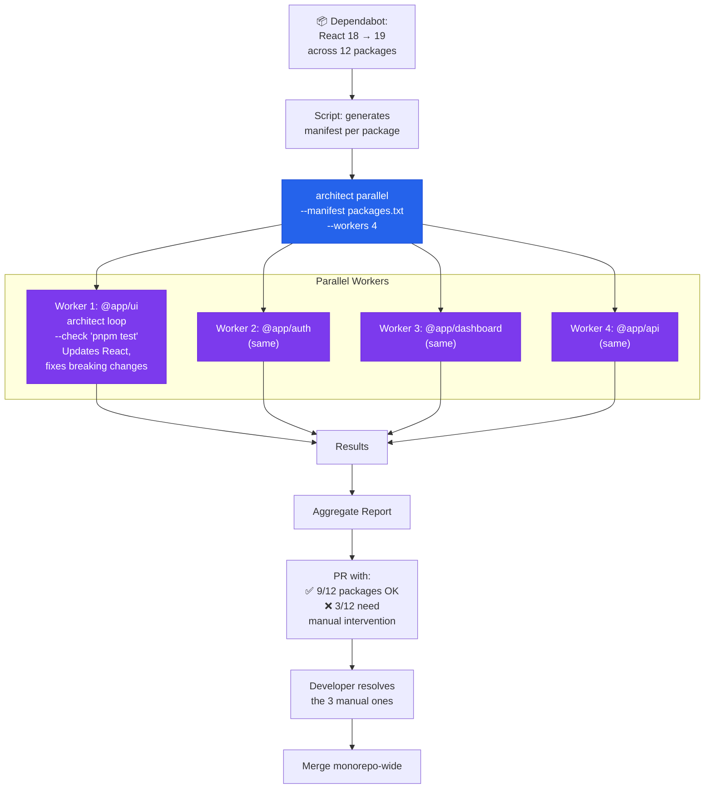

# Monorepo Dependency Updater

> React 18→19 across 12 packages. Parallel workers update each package with Ralph Loop.

## The problem

Monorepos with 10-50 packages. A dependency update (TypeScript 5.5→5.6, React 18→19, Node 18→22) needs to be applied across all packages, each with its own quirks. Renovate and Dependabot create PRs but do not fix breaking changes. The result: 12 open PRs, each requiring manual intervention.

## Where architect fits in

**Parallel runs per package**: each worker updates the dependency in its package, runs Ralph Loop until tests pass, and reports. The result is an aggregated PR with all packages that migrated correctly, and a report of those that need manual intervention.

## Diagram



## Implementation

### Orchestration script

```bash
#!/bin/bash
# update-dependency.sh

DEPENDENCY=$1   # e.g., "react"
FROM_VERSION=$2 # e.g., "18"
TO_VERSION=$3   # e.g., "19"

# 1. Find packages that use the dependency
find packages/ -name "package.json" \
  -exec grep -l "\"$DEPENDENCY\"" {} \; \
  | sed 's|/package.json||' \
  > packages-to-update.txt

echo "$(wc -l < packages-to-update.txt) packages to update"

# 2. Parallel update with Ralph Loop per package
architect parallel \
  "Update $DEPENDENCY from v$FROM_VERSION to v$TO_VERSION in this package. \
   First update package.json. Then run the tests. \
   If there are breaking changes, fix them following the official migration guide. \
   Follow the rules in .architect.md." \
  --manifest packages-to-update.txt \
  --workers 4 \
  --config .architect.yaml \
  --confirm-mode yolo

# 3. Generate report
echo "=== Results ==="
for pkg in $(cat packages-to-update.txt); do
  if [ -f "$pkg/.architect-result.json" ]; then
    echo "✅ $pkg"
  else
    echo "❌ $pkg — needs manual intervention"
  fi
done
```

### Configuration

```yaml
# .architect.yaml
llm:
  model: openai/gpt-4.1
  api_key_env: OPENAI_API_KEY

guardrails:
  protected_files:
    - "pnpm-lock.yaml"     # The lock is regenerated by pnpm, not the agent
    - "pnpm-workspace.yaml"
    - ".github/**"
    - "turbo.json"
  max_files_modified: 10   # Per package

costs:
  budget_usd: 0.50  # Per package
```

### .architect.md for updates

```markdown
# Dependency Update Rules

## Process
1. Update version in package.json
2. Run pnpm install
3. Run pnpm test to detect breaking changes
4. If there are breaking changes, consult MIGRATION.md (if it exists)
5. Fix each breaking change
6. Re-run tests until they pass

## Required
- Do not change the package's public APIs
- Do not update unsolicited dependencies
- Maintain compatibility with other packages in the monorepo

## Prohibited
- Do not run pnpm install --no-frozen-lockfile
- Do not delete failing tests
- Do not ignore TypeScript errors with @ts-ignore
```

## Architect features used

| Feature | Role in this architecture |
|---------|--------------------------|
| **Parallel** | N packages processed simultaneously in worktrees |
| **Ralph Loop** | Per package: update→test→fix breaking changes→retest |
| **Guardrails** | Protects lockfile, workspace config, CI configs |
| **.architect.md** | Update rules (do not break APIs, no @ts-ignore) |
| **Reports** | Per-package result: success, failure, partial |
| **Budget** | $0.50 per package prevents runaway costs |

## Value

- **Without architect**: 12 Dependabot PRs x 30min of manual fix = 6h of work
- **With architect**: 1 command, 9/12 packages updated automatically, 3 with a report of what fails for manual fix. Total time: 15min of review.
