# PR Quality Gate + Auto-Remediation

> Linters and SAST detect findings → architect applies fixes → pushes to the same PR.

## The problem

Teams use ESLint, Ruff, Semgrep, and type checkers in PRs. When they fail, the developer interprets the error, fixes it, pushes, and waits for CI to run again. A cycle of 3-5 iterations just to pass the quality gate. Multiplied by 10 PRs per day, that is hours lost on mechanical work.

## Where architect fits in

Architect positions itself **after the scanner and before the human review**. It reads the findings, applies fixes while respecting guardrails and project conventions, and pushes a remediation commit to the same PR. The developer only reviews the fix — they do not implement it.

## Diagram

```mermaid
flowchart LR
    A["PR opened"] --> B["CI Pipeline"]

    subgraph quality_gate["Automated Quality Gate"]
        B --> C["ESLint / Ruff"]
        B --> D["Semgrep SAST"]
        B --> E["Type Check"]
    end

    C --> F{"All pass?"}
    D --> F
    E --> F

    F -->|"✅"| G["Human Review"]
    F -->|"❌ Findings"| H["architect run\n'Fix findings'"]

    H --> I["Reads findings\nas context"]
    I --> J["Applies fixes\n(.architect.md\nrespected)"]
    J --> K["git commit\n--amend / new"]
    K --> B

    G --> L["✅ Merge"]

    style H fill:#2563eb,color:#fff,stroke:#1d4ed8
    style I fill:#2563eb,color:#fff,stroke:#1d4ed8
    style J fill:#7c3aed,color:#fff,stroke:#6d28d9
```



## Implementation

### GitHub Actions workflow

```yaml
# .github/workflows/quality-gate.yml
name: Quality Gate + Auto-Fix
on: [pull_request]

jobs:
  lint:
    runs-on: ubuntu-latest
    steps:
      - uses: actions/checkout@v4
        with:
          ref: ${{ github.head_ref }}

      - name: Run linters
        id: lint
        run: |
          ruff check src/ --output-format json > findings.json 2>&1 || true
          semgrep --json -o semgrep-findings.json . || true
        continue-on-error: true

      - name: Auto-fix with architect
        if: steps.lint.outcome == 'failure'
        run: |
          architect run "Fix all findings from the files \
            findings.json and semgrep-findings.json. \
            Do not change business logic. Only apply lint \
            and security fixes." \
            --config .architect.yaml \
            --confirm-mode yolo \
            --report-file fix-report.json
        env:
          OPENAI_API_KEY: ${{ secrets.LLM_KEY }}

      - name: Push fix
        run: |
          git add -A
          git commit -m "fix: auto-remediation via architect" || exit 0
          git push
```

### Configuration with code_rules

```yaml
# .architect.yaml
llm:
  model: openai/gpt-4.1
  api_key_env: OPENAI_API_KEY

guardrails:
  protected_files:
    - "*.env*"
    - "*.pem"
    - "Dockerfile"
    - "docker-compose.yml"
    - ".github/**"
  max_files_modified: 15
  code_rules:
    - pattern: 'eval\('
      message: "eval() prohibited — use a safe alternative"
      severity: block
    - pattern: 'dangerouslySetInnerHTML'
      message: "XSS risk — use sanitization"
      severity: block
    - pattern: 'innerHTML\s*='
      message: "XSS risk — use textContent or sanitization"
      severity: warn

hooks:
  post_tool_use:
    - name: auto-format
      command: "ruff format $CLIA_FILE_PATH 2>/dev/null || true"
```

## Architect features used

| Feature | Role in this architecture |
|---------|--------------------------|
| **run** | Single execution: reads findings, applies fixes |
| **Guardrails** | Protects sensitive files, limits scope |
| **code_rules** | Ensures the fix does not introduce new problems |
| **Hooks** | Auto-format after each edit |
| **.architect.md** | Team conventions (style, imports, patterns) |
| **Reports** | Record of what changed for the PR |

## Variant: Auto-format only

For teams that only want automatic formatting without logic fixes:

```bash
architect run "Run ruff format and ruff check --fix on all \
  modified files in this PR. Do not change anything manually." \
  --confirm-mode yolo --budget 0.05
```
