# QA Bug Triage → Auto-Fix

> Bug reported in Jira → architect reads the ticket via MCP → attempts fix → creates PR or escalates.

## The problem

The lifecycle of a bug: QA detects it → creates a ticket in Jira/Linear → developer reads it → reproduces → debugs → fixes → PR → review → merge. A minor bug (typo, NPE, off-by-one) can take 2-5 days to resolve. 60% of these bugs are trivial and should not consume that cycle time.

## Where architect fits in

Architect reads the bug report via MCP (connected to the issue tracker), attempts the fix with Ralph Loop, and if successful, creates a PR and links it to the ticket. The developer only reviews the PR. If architect cannot fix it, it comments on the ticket with context about what it tried to accelerate the manual fix.

## Diagram

```mermaid
flowchart TD
    A["🐛 QA reports bug\nin Jira/Linear"] --> B["Webhook / Cron\ndetects new ticket"]

    B --> C{"Label:\nauto-fixable?"}
    C -->|"No"| D["Normal development\nqueue"]
    C -->|"Yes"| E["architect run\nvia MCP reads ticket"]

    E --> F["MCP: read_issue\ngets description,\nsteps to reproduce"]

    F --> G["architect loop\n--check 'pytest tests/'\ncontext: bug report"]

    G --> H{"Fix successful?\nTests pass?"}
    H -->|"✅"| I["Creates PR\n+ links ticket"]
    H -->|"❌"| J["Comments on ticket:\n'Attempted auto-fix,\nneeds human'\n+ attempt context"]

    I --> K["Developer Review"]
    K -->|"✅ Approve"| L["Merge + Ticket\nclosed automatically"]
    K -->|"❌ Reject"| D

    style E fill:#2563eb,color:#fff,stroke:#1d4ed8
    style F fill:#f59e0b,color:#000,stroke:#d97706
    style G fill:#2563eb,color:#fff,stroke:#1d4ed8
    style J fill:#dc2626,color:#fff,stroke:#b91c1c
```



## Implementation

### MCP configuration

```yaml
# .architect.yaml
llm:
  model: openai/gpt-4.1
  api_key_env: OPENAI_API_KEY

mcp:
  servers:
    - name: jira
      url: http://jira-mcp-bridge:8080/mcp
      auth:
        type: bearer
        token_env: JIRA_MCP_TOKEN
    - name: github
      url: http://github-mcp-bridge:8081/mcp
      auth:
        type: bearer
        token_env: GITHUB_TOKEN

guardrails:
  protected_files:
    - "*.env*"
    - "migrations/**"
    - "*.lock"
  max_files_modified: 5

costs:
  budget_usd: 0.75
```

### Orchestration script

```bash
#!/bin/bash
# auto-fix-ticket.sh — called by webhook or cron

TICKET_ID=$1

# architect reads the ticket via MCP and attempts to fix it
architect loop \
  "Read ticket $TICKET_ID from Jira using the MCP tool read_issue. \
   Understand the bug report, reproduce the error by running the tests, \
   and fix it. The fix must be minimal and not change existing \
   behavior." \
  --check "pytest tests/ -q" \
  --config .architect.yaml \
  --confirm-mode yolo \
  --max-iterations 5 \
  --report-file "reports/${TICKET_ID}.json"

EXIT_CODE=$?

if [ $EXIT_CODE -eq 0 ]; then
  # Success: create PR
  git checkout -b "fix/${TICKET_ID}"
  git add -A
  git commit -m "fix(${TICKET_ID}): auto-fix via architect"
  git push -u origin "fix/${TICKET_ID}"
  gh pr create --title "fix(${TICKET_ID}): auto-fix" \
    --body "$(cat reports/${TICKET_ID}.json)"
else
  # Failure: comment on ticket with context
  echo "Auto-fix failed after 5 attempts. See report for details." \
    | jira-cli comment "$TICKET_ID"
fi
```

## Architect features used

| Feature | Role in this architecture |
|---------|--------------------------|
| **MCP** | Reads bug tickets from Jira without scraping or custom APIs |
| **Ralph Loop** | Iterates fix→test until the tests pass |
| **Guardrails** | Limits touchable files and protects migrations |
| **Reports** | JSON with attempt details (success or failure) |
| **Sessions** | Persistent context if resuming is needed |
| **Budget** | Limits cost per ticket to $0.75 |

## Criteria for the "auto-fixable" label

Not all bugs are candidates. Good candidates:
- Errors with a clear stack trace (NPE, TypeError, IndexError)
- Tests that already exist and fail
- Bugs in simple logic (off-by-one, inverted condition)
- Typos in strings, messages, or configuration

Poor candidates:
- Design or architecture bugs
- Race conditions
- Bugs without tests to reproduce them
- Performance issues
