# Security Vulnerability Remediation Pipeline

> Scanner detects CVEs → 4-step pipeline analyzes, fixes, re-scans, and documents.

## The problem

Semgrep, Snyk, CodeQL, or Dependabot detect vulnerabilities but do not fix them (or generate basic fixes that require review). The gap between "vulnerability detected" and "fix merged" can be weeks. With the EU AI Act entering into force August 2026 and its 72h/15d incident reporting windows, that gap is unacceptable.

## Where architect fits in

Architect as a **4-step remediation pipeline**: analyze → fix → verify → document. Pipeline mode orchestrates the sequence. Guardrails ensure the fix does not introduce new problems. The report documents everything for compliance.

## Diagram

```mermaid
flowchart TD
    A["🔍 Security Scanner\n(Semgrep / Snyk / CodeQL)"] --> B["Findings JSON\n(CVEs, CWEs)"]

    B --> C["architect pipeline\nsecurity-remediation.yaml"]

    subgraph architect_pipeline["Architect Pipeline"]
        direction TB
        C --> D["Step 1: Analyze\nRead findings,\nprioritize by severity"]
        D --> E["Step 2: Fix\narchitect loop\n--check 'semgrep --error'"]
        E --> F["Step 3: Verify\nFull re-scan"]
        F --> G["Step 4: Document\nGenerate security\nchangelog"]
    end

    G --> H{"Re-scan\nclean?"}
    H -->|"✅"| I["PR with fix +\ncompliance report"]
    H -->|"❌"| J["Escalate to\nSecurity Team"]

    I --> K["Security Review"]
    K --> L["✅ Merge"]

    style C fill:#2563eb,color:#fff,stroke:#1d4ed8
    style D fill:#7c3aed,color:#fff,stroke:#6d28d9
    style E fill:#7c3aed,color:#fff,stroke:#6d28d9
    style F fill:#7c3aed,color:#fff,stroke:#6d28d9
    style G fill:#7c3aed,color:#fff,stroke:#6d28d9
    style J fill:#dc2626,color:#fff,stroke:#b91c1c
```



## Implementation

### Pipeline YAML

```yaml
# security-remediation.yaml
name: security-fix
steps:
  - name: analyze
    agent: build
    task: >
      Read the findings.json file with the security findings.
      Prioritize: CRITICAL > HIGH > MEDIUM. Ignore LOW.
      Create a remediation plan in REMEDIATION_PLAN.md with:
      - Each vulnerability (CVE ID, severity, affected file)
      - Proposed fix for each one
      - Application order (dependencies first)

  - name: fix
    agent: build
    task: >
      Execute the plan from REMEDIATION_PLAN.md.
      Fix each vulnerability without changing functional behavior.
      Run the existing tests after each fix to verify
      there are no regressions.

  - name: verify
    agent: build
    task: >
      Run semgrep with the same rules as the original scan.
      Verify that the CRITICAL and HIGH findings are resolved.
      If any findings remain, document them with justification.

  - name: document
    agent: build
    task: >
      Create SECURITY_CHANGELOG.md with:
      - Fixed vulnerabilities (CVE ID, severity, applied fix)
      - Unfixed vulnerabilities (justification)
      - Tests executed and results
      - Timestamp and scanner rules version
```

### Execution

```bash
# 1. Scan
semgrep --json -o findings.json --config p/owasp-top-ten .

# 2. Remediation pipeline
architect pipeline security-remediation.yaml \
  --config .architect.yaml \
  --confirm-mode yolo \
  --budget 2.00

# 3. Verify and create PR
git checkout -b security/auto-remediation
git add -A
git commit -m "fix(security): automated vulnerability remediation"
git push -u origin security/auto-remediation
```

### Security guardrails

```yaml
guardrails:
  protected_files:
    - "*.env*"
    - "*.pem"
    - "*.key"
    - "migrations/**"
    - ".github/**"
  max_files_modified: 20
  code_rules:
    - pattern: 'eval\('
      severity: block
    - pattern: 'exec\('
      severity: block
    - pattern: 'subprocess\.call\('
      message: "Use subprocess.run with check=True"
      severity: warn
    - pattern: 'pickle\.loads?\('
      message: "Unsafe deserialization — use json"
      severity: block
  blocked_commands:
    - "rm -rf"
    - "curl | sh"
    - "wget | bash"
```

## Architect features used

| Feature | Role in this architecture |
|---------|--------------------------|
| **Pipeline** | Orchestrates the 4 steps in sequence |
| **Ralph Loop** | Within the "fix" step: iterates until semgrep passes |
| **Guardrails** | Prevents the fix from touching migrations, secrets, or CI configs |
| **code_rules** | Blocks insecure patterns in the fix itself |
| **Reports** | SECURITY_CHANGELOG.md as evidence for compliance |
| **Hooks** | Auto-lint after each edit |

## Compliance value

The output of this architecture generates artifacts directly useful for:

- **OWASP Agentic Top 10**: Evidence of automated mitigation with guardrails
- **EU AI Act Article 26**: Audit trail of remediation with timestamps
- **SOC 2**: Security change log with traceability
