# Self-Healing CI/CD Pipeline

> Tests fail in CI → architect automatically fixes them → creates a PR with the fix.

## The problem

The most frustrating CI/CD pattern: a developer pushes, tests fail due to an edge case, and the pipeline stalls waiting for human attention. At 3am nobody is watching. At 9am there are 5 blocked PRs and the team starts the day resolving broken tests instead of building features.

In 2026 this has a name: the **"Pipeline Doctor" or "Interceptor pattern"**. A failure is not a stop signal — it is a trigger for a repair agent. GitHub, GitLab, and the major platforms are converging toward this model.

## Where architect fits in

Architect positions itself as the **Repair Agent** between the test failure and the creation of a PR with the fix. Its Ralph Loop is exactly the primitive this pattern needs: fix→test→verify in a loop until it passes or the budget runs out.

## Diagram

```mermaid
flowchart TD
    A["👨‍💻 Developer Push"] --> B["GitHub Actions / GitLab CI"]
    B --> C{"🧪 Tests"}
    C -->|"✅ Pass"| D["Deploy / Merge"]
    C -->|"❌ Fail"| E["architect loop\n--check 'pytest'\n--budget 0.50"]

    E --> F{"Ralph Loop"}
    F --> G["LLM analyzes\nerror logs"]
    G --> H["Applies fix\n(guardrails active)"]
    H --> I{"pytest passes?"}
    I -->|"❌ No"| G
    I -->|"✅ Yes"| J["Generates JSON report"]

    J --> K["git commit + push\nnew branch"]
    K --> L["Creates automatic PR\nwith attached report"]
    L --> M["👨‍💻 Human Code Review"]
    M --> D

    F -->|"Budget exhausted\nor max_iterations"| N["❌ Escalation\nNotify team"]

    style E fill:#2563eb,color:#fff,stroke:#1d4ed8
    style F fill:#2563eb,color:#fff,stroke:#1d4ed8
    style H fill:#7c3aed,color:#fff,stroke:#6d28d9
    style J fill:#059669,color:#fff,stroke:#047857
    style N fill:#dc2626,color:#fff,stroke:#b91c1c
```



## Implementation

### GitHub Actions workflow

```yaml
# .github/workflows/self-healing.yml
name: Self-Healing Tests
on: [push, pull_request]

jobs:
  test:
    runs-on: ubuntu-latest
    steps:
      - uses: actions/checkout@v4
      - uses: actions/setup-python@v5
        with:
          python-version: '3.12'

      - name: Run tests
        id: tests
        run: pytest tests/ -q
        continue-on-error: true

      - name: Auto-fix with architect
        if: steps.tests.outcome == 'failure'
        run: |
          pip install architect-ai-cli
          architect loop "Fix the failing tests. \
            Read the pytest output to understand what fails \
            and apply the minimal fix needed." \
            --check "pytest tests/ -q" \
            --config .architect.yaml \
            --confirm-mode yolo \
            --budget 0.50 \
            --max-iterations 5 \
            --report-file fix-report.json \
            --exit-code-on-partial 1
        env:
          OPENAI_API_KEY: ${{ secrets.LLM_KEY }}

      - name: Create PR with fix
        if: steps.tests.outcome == 'failure' && success()
        uses: peter-evans/create-pull-request@v6
        with:
          title: "[architect] Auto-fix: tests corrected"
          body-path: fix-report.json
          branch: architect/auto-fix-${{ github.sha }}
          commit-message: "fix: auto-remediation via architect Ralph Loop"
```

### Architect configuration

```yaml
# .architect.yaml
llm:
  model: openai/gpt-4.1
  api_base: https://api.openai.com/v1
  api_key_env: OPENAI_API_KEY

guardrails:
  protected_files:
    - ".env"
    - "*.pem"
    - "*.key"
    - "docker-compose.yml"
    - "Dockerfile"
    - ".github/**"
  max_files_modified: 10
  code_rules:
    - pattern: 'eval\('
      severity: block
    - pattern: 'exec\('
      severity: block

costs:
  budget_usd: 0.50
```

## Architect features used

| Feature | Role in this architecture |
|---------|--------------------------|
| **Ralph Loop** | Core: fix→test→verify cycle until pytest passes |
| **Guardrails** | Protects CI/CD files, secrets, and Dockerfiles |
| **Budget** | Hard limit to prevent runaway costs at 3am |
| **Reports** | JSON attached to the PR as evidence of what changed |
| **Exit codes** | `--exit-code-on-partial` so CI knows if it was successful |
| **.architect.md** | Project conventions respected in the fix |

## Escalation flow

If architect cannot fix the tests (budget exhausted or max_iterations reached), the workflow must escalate:

```yaml
      - name: Notify failure
        if: steps.tests.outcome == 'failure' && failure()
        uses: slackapi/slack-github-action@v1
        with:
          payload: |
            {
              "text": "⚠️ Auto-fix failed in ${{ github.repository }}. Tests still broken after 5 attempts ($0.50 budget). Requires manual intervention.",
              "blocks": [...]
            }
```

## Differential value

Without architect, implementing this pattern requires:
- Custom retry loop
- Pytest error parsing
- Secure code execution with sandboxing
- Cost tracking per iteration
- Iteration limits with fallback
- Report generation for the PR

Architect packages it all into **a single command** with guardrails included. The GitHub Actions workflow goes from ~100 lines of custom script to ~15 lines.
