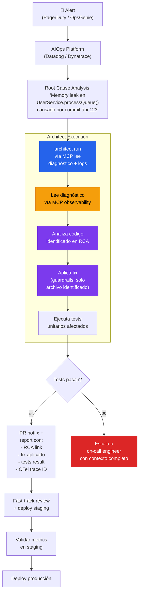

# AIOps Incident Code Remediation

> Alerta → AIOps diagnostica root cause → architect aplica hotfix de código → PR con trazabilidad completa.

## El problema

El paradigma Agentic SRE de 2026 tiene 3 capas: data plane (telemetría), reasoning layer (diagnóstico), y action layer (remediación). Las plataformas AIOps — Dynatrace, PagerDuty, Datadog — cubren las dos primeras. La tercera, escribir y deployar código correctivo, es donde la mayoría falla. El diagnóstico dice "memory leak en UserService.processQueue() causado por commit abc123" pero nadie escribe el fix automáticamente.

## Dónde encaja architect

Architect es la **action layer** que toma el diagnóstico del AIOps y lo convierte en un fix de código. Recibe contexto vía MCP (conectado a la plataforma de observabilidad), aplica el fix con guardrails estrictos de producción, y genera un report para el post-mortem con traza OTel completa.

## Diagrama



## Implementación

### Configuración

```yaml
# .architect.yaml
llm:
  model: openai/gpt-4.1
  api_key_env: OPENAI_API_KEY

mcp:
  servers:
    - name: datadog
      url: http://datadog-mcp-bridge:8082/mcp
      auth:
        type: bearer
        token_env: DD_MCP_TOKEN

guardrails:
  max_files_modified: 3    # Hotfix = cambio quirúrgico
  protected_files:
    - "*.env*"
    - "config/production.*"
    - "k8s/production/**"
    - "Dockerfile*"
    - "*.lock"
  blocked_commands:
    - "kubectl apply"
    - "docker push"
    - "npm publish"
    - "terraform apply"

costs:
  budget_usd: 1.00  # Hard limit por incidente

telemetry:
  enabled: true
  exporter: otlp
  endpoint: http://otel-collector:4317
```

### Script de integración

```bash
#!/bin/bash
# incident-autofix.sh — llamado por PagerDuty webhook

INCIDENT_ID=$1
RCA_SUMMARY=$2

architect run \
  "Un incidente de producción ha sido diagnosticado. \
   Incident ID: ${INCIDENT_ID}. \
   Root cause: ${RCA_SUMMARY}. \
   Lee los logs detallados del incidente vía MCP (tool: get_incident_logs). \
   Identifica el archivo y función afectados. \
   Aplica el fix MÍNIMO necesario. \
   Ejecuta solo los tests del módulo afectado." \
  --config .architect.yaml \
  --confirm-mode yolo \
  --budget 1.00 \
  --report-file "incidents/${INCIDENT_ID}-report.json"

EXIT_CODE=$?

if [ $EXIT_CODE -eq 0 ]; then
  git checkout -b "hotfix/${INCIDENT_ID}"
  git add -A
  git commit -m "hotfix(${INCIDENT_ID}): auto-remediation via architect"
  git push -u origin "hotfix/${INCIDENT_ID}"
  gh pr create \
    --title "🚨 hotfix(${INCIDENT_ID}): auto-remediation" \
    --body "$(cat incidents/${INCIDENT_ID}-report.json)" \
    --label "hotfix,auto-generated"
fi
```

## Features de architect usadas

| Feature | Rol en esta arquitectura |
|---------|------------------------|
| **MCP** | Lee diagnóstico y logs de la plataforma AIOps |
| **run** | Ejecución única: un incidente, un fix |
| **Guardrails** | Ultra-estrictos: max 3 archivos, bloquea deploy commands |
| **Budget** | $1.00 hard limit por incidente |
| **OTel** | Trace ID de la ejecución linkeable al incidente |
| **Reports** | JSON completo para el post-mortem |

## Guardrails son críticos aquí

En un contexto de incidente de producción, los guardrails no son opcionales — son la diferencia entre "agente arregla el bug" y "agente tira producción". Por eso:

- `max_files_modified: 3` — un hotfix toca 1-2 archivos, nunca 10
- `blocked_commands` — el agente no puede deployar, solo escribir código
- `protected_files` — configs de producción intocables
- `budget_usd: 1.00` — si el fix no sale en ~3-5 llamadas LLM, escala a humano
