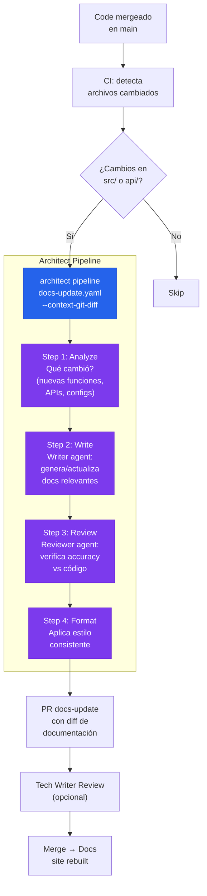

# Documentation-as-Code Pipeline

> Code mergeado → architect lee git diff → Writer genera docs → Reviewer verifica → PR de docs.

## El problema

La documentación se queda obsoleta el día después de escribirse. Los equipos saben que la necesitan actualizada pero no tienen tiempo. Resultado: README.md de hace 2 años, API docs que no coinciden con el código, y onboarding doloroso para los nuevos del equipo.

## Dónde encaja architect

Architect como **pipeline post-merge** que lee los cambios (git diff), genera/actualiza documentación relevante, y crea un PR de docs. No reemplaza la documentación escrita por humanos — la mantiene sincronizada con el código usando el patrón Writer/Reviewer con sub-agentes.

## Diagrama



## Implementación

### Pipeline YAML con Writer/Reviewer

```yaml
# docs-update.yaml
name: docs-sync
steps:
  - name: analyze-changes
    agent: build
    task: >
      Analiza el git diff del último merge a main.
      Identifica: nuevas funciones públicas, cambios en APIs,
      nuevos archivos de configuración, cambios en dependencias.
      Genera DOCS_PLAN.md con secciones de documentación a actualizar.
      Solo incluye cambios relevantes para usuarios — ignora refactors internos.

  - name: write-docs
    agent: build
    task: >
      Siguiendo DOCS_PLAN.md, actualiza la documentación existente.
      Si hay funciones nuevas, añade docstrings y actualiza API reference.
      Si hay configs nuevas, documenta en la guía de configuración.
      Si hay endpoints nuevos, actualiza la API reference con ejemplos.
      Mantén el tono y estilo de la documentación existente.

  - name: review-docs
    agent: reviewer
    task: >
      Revisa la documentación generada en el step anterior.
      Verifica que cada ejemplo de código es correcto.
      Verifica que los tipos y parámetros documentados coinciden
      con el código real (lee los source files).
      Si encuentras inconsistencias, anótalas en REVIEW_NOTES.md
      y corrige las que puedas.

  - name: format
    agent: build
    task: >
      Aplica formato consistente a todos los archivos .md modificados.
      Verifica que los links internos no están rotos.
      Ejecuta markdownlint si está disponible.
```

### GitHub Actions workflow

```yaml
# .github/workflows/docs-sync.yml
name: Docs Sync
on:
  push:
    branches: [main]
    paths:
      - 'src/**'
      - 'api/**'
      - 'config/**'

jobs:
  docs:
    runs-on: ubuntu-latest
    steps:
      - uses: actions/checkout@v4
        with:
          fetch-depth: 2  # Para git diff

      - name: Update docs
        run: |
          architect pipeline docs-update.yaml \
            --config .architect.yaml \
            --confirm-mode yolo \
            --context-git-diff HEAD~1 \
            --budget 0.30
        env:
          OPENAI_API_KEY: ${{ secrets.LLM_KEY }}

      - uses: peter-evans/create-pull-request@v6
        with:
          title: "docs: sync with latest code changes"
          branch: docs/auto-sync
```

## Features de architect usadas

| Feature | Rol en esta arquitectura |
|---------|------------------------|
| **Pipeline** | 4 pasos: analyze → write → review → format |
| **Sub-agents** | Writer genera, Reviewer verifica contra código real |
| **context-git-diff** | Contexto automático de qué cambió |
| **.architect.md** | Estilo de documentación del equipo |
| **Guardrails** | Protege source code (docs pipeline solo toca .md) |

## Guardrails para docs pipeline

```yaml
guardrails:
  protected_files:
    - "src/**"        # No tocar código — solo documentar
    - "tests/**"
    - "*.py"
    - "*.ts"
    - "*.js"
    - "package.json"
  # Solo puede modificar docs
  # max_files_modified aplica solo a .md files
```
