# Infrastructure as Code con Guardrails

> Genera Terraform con guardrails de infraestructura. Dry-run, validate, tfsec scan, documentación automática.

## El problema

Los equipos DevOps escriben Terraform, Pulumi, o Kubernetes manifests manualmente. Los errores en IaC van directos a producción: un security group abierto a `0.0.0.0/0`, un bucket S3 público, un pod sin resource limits. Las herramientas de AI coding generan IaC pero sin guardrails específicos de infraestructura.

## Dónde encaja architect

Architect genera IaC con **guardrails específicos de infraestructura** (no exponer puertos, no recursos sin tags, no imágenes sin digest). El **dry-run** muestra qué se generaría sin aplicar. El **pipeline** valida con `terraform plan` y `tfsec` antes de proponer.

## Diagrama

```mermaid
flowchart TD
    A["📋 Change Request\n'Necesitamos Redis cluster\nen staging'"] --> B["architect pipeline\niac-generate.yaml"]

    subgraph architect_pipeline["Architect Pipeline"]
        direction TB
        B --> C["Step 1: Plan\nGenera Terraform\ncon .architect.md\n(IaC conventions)"]
        C --> D["Step 2: Validate\nterraform validate\nterraform plan"]
        D --> E["Step 3: Security\ntfsec / checkov\nscan"]
        E --> F["Step 4: Document\nGenera README\ncon diagrama infra"]
    end

    F --> G{"Validate +\nSecurity OK?"}
    G -->|"✅"| H["PR con:\n- .tf files\n- plan output\n- security report\n- README"]
    G -->|"❌"| I["architect loop\ncorrige findings\nde tfsec"]
    I --> D

    H --> J["👨‍💻 DevOps Review"]
    J --> K["terraform apply\n(manual o CD)"]

    style B fill:#2563eb,color:#fff,stroke:#1d4ed8
    style C fill:#7c3aed,color:#fff,stroke:#6d28d9
    style D fill:#7c3aed,color:#fff,stroke:#6d28d9
    style E fill:#7c3aed,color:#fff,stroke:#6d28d9
    style F fill:#7c3aed,color:#fff,stroke:#6d28d9
```



## Implementación

### Guardrails de infraestructura

```yaml
# .architect.yaml
guardrails:
  protected_files:
    - "*.tfstate"
    - "*.tfstate.backup"
    - ".terraform.lock.hcl"
    - "backend.tf"      # El backend de state no se toca
  code_rules:
    # No buckets S3 públicos
    - pattern: 'acl\s*=\s*"public'
      message: "S3 buckets must not be public"
      severity: block
    # No security groups abiertos al mundo
    - pattern: 'cidr_blocks\s*=\s*\["0\.0\.0\.0/0"\]'
      message: "Do not open security groups to 0.0.0.0/0"
      severity: block
    # No imágenes Docker sin tag fijo
    - pattern: 'image\s*=\s*"[^:]*"'
      message: "Docker images must have explicit tag (no :latest)"
      severity: warn
  blocked_commands:
    - "terraform apply"
    - "terraform destroy"
    - "kubectl delete"
    - "aws s3 rm"
```

### Pipeline YAML

```yaml
# iac-generate.yaml
name: iac-generation
steps:
  - name: generate
    agent: build
    task: >
      Genera los archivos Terraform para el recurso solicitado.
      Sigue las convenciones de .architect.md (naming, tags, estructura).
      Incluye: main.tf, variables.tf, outputs.tf.
      Todos los recursos deben tener tags: Environment, Project, ManagedBy.

  - name: validate
    agent: build
    task: >
      Ejecuta 'terraform init -backend=false' y 'terraform validate'.
      Si hay errores, corrígelos. Ejecuta 'terraform plan' y guarda
      el output en plan-output.txt.

  - name: security-scan
    agent: build
    task: >
      Ejecuta 'tfsec .' y analiza los findings.
      Corrige los de severidad HIGH y CRITICAL.
      Documenta los MEDIUM con justificación si no se pueden corregir.

  - name: document
    agent: build
    task: >
      Genera un README.md con:
      - Qué recursos se crean
      - Variables requeridas
      - Outputs disponibles
      - Diagrama de la infraestructura (mermaid)
```

### .architect.md para IaC

```markdown
# Terraform Conventions

## Estructura
- Un directorio por módulo
- main.tf, variables.tf, outputs.tf, versions.tf
- terraform/ directorio para configs de backend

## Naming
- Recursos: snake_case descriptivo (aws_security_group.api_ingress)
- Variables: descriptivas con type y description obligatorios
- Outputs: prefijo del recurso (redis_endpoint, redis_port)

## Obligatorio
- Tags en TODOS los recursos: Environment, Project, ManagedBy="terraform"
- Variables con descripción y tipo explícito
- Lifecycle prevent_destroy en recursos de datos (RDS, S3)
- Encryption at rest habilitado siempre

## Prohibido
- No hardcodear IPs, ARNs, o account IDs
- No usar default VPC
- No security groups con 0.0.0.0/0 ingress
- No recursos sin tags
```

## Features de architect usadas

| Feature | Rol en esta arquitectura |
|---------|------------------------|
| **Pipeline** | 4 pasos: generate → validate → security → document |
| **Dry-run** | Preview de lo que se generaría sin tocar el repo |
| **Guardrails** | Protege tfstate, bloquea `terraform apply/destroy` |
| **code_rules** | Bloquea patrones inseguros (S3 público, SG abiertos) |
| **.architect.md** | Naming conventions, estructura, tags obligatorios |
| **Reports** | plan output + security scan como artefactos del PR |
