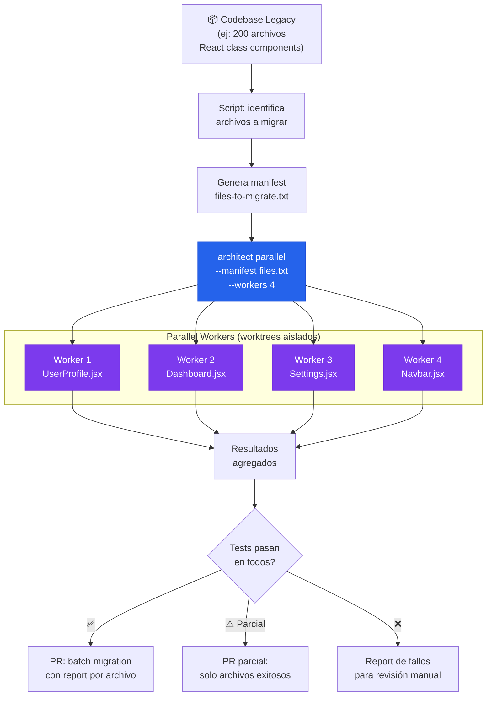

# Codebase Migration Factory

> 200 archivos por migrar. Parallel workers procesan cada archivo en worktrees aislados.

## El problema

Las migraciones de código (Python 2→3, React class→hooks, Express→Fastify, Java 8→21) son tareas repetitivas pero diferentes archivo por archivo. Un equipo de 5 personas puede tardar meses. Cada archivo es la misma tarea con distinto contexto. Es el candidato perfecto para paralelización.

## Dónde encaja architect

**Parallel runs**: cada archivo se migra en un worktree git aislado. El `.architect.md` contiene las reglas de migración. Los workers procesan N archivos en paralelo. Al final, un report agregado muestra cuáles migraron correctamente y cuáles necesitan intervención.

## Diagrama



## Implementación

### Flujo completo

```bash
# 1. Identificar archivos a migrar
find src/ -name "*.jsx" -exec grep -l "extends React.Component" {} \; \
  > files-to-migrate.txt

echo "$(wc -l < files-to-migrate.txt) archivos encontrados"

# 2. Preview con dry-run
architect parallel "Migra este componente de React class a hooks" \
  --manifest files-to-migrate.txt \
  --workers 1 \
  --dry-run

# 3. Ejecutar migración
architect parallel "Migra este componente de React class a functional \
  component con hooks. Sigue las reglas de .architect.md" \
  --manifest files-to-migrate.txt \
  --workers 4 \
  --config .architect.yaml \
  --confirm-mode yolo
```

### .architect.md para migración

```markdown
# Migration Rules: React Class → Hooks

## OBLIGATORIO
- Convertir class components a functional components con hooks
- useState para this.state
- useEffect para componentDidMount, componentDidUpdate, componentWillUnmount
- useCallback para métodos bound en constructor
- Preservar TODOS los props y su tipado TypeScript

## PROHIBIDO
- No cambiar nombres de componentes ni exports
- No cambiar la API pública (props interface)
- No añadir dependencias nuevas
- No modificar archivos de test (se adaptarán después)
- No cambiar estilos CSS/SCSS

## VERIFICACIÓN
- El componente debe compilar sin errores TypeScript
- Los tests existentes deben pasar sin modificación
- El output renderizado debe ser idéntico
```

### Configuración

```yaml
# .architect.yaml
llm:
  model: openai/gpt-4.1
  api_key_env: OPENAI_API_KEY

guardrails:
  protected_files:
    - "package.json"
    - "package-lock.json"
    - "tsconfig.json"
    - "*.test.tsx"
    - "*.spec.tsx"
  max_files_modified: 2  # Por worker: solo el archivo + su barrel
```

## Features de architect usadas

| Feature | Rol en esta arquitectura |
|---------|------------------------|
| **Parallel** | N archivos procesados simultáneamente en worktrees |
| **.architect.md** | Reglas de migración consistentes para todos los workers |
| **Guardrails** | Protege tests, configs, y lock files |
| **Dry-run** | Preview antes de lanzar la migración real |
| **Reports** | Resultado por archivo: éxito, fallo, o parcial |

## Otros casos de migración

El mismo patrón aplica a:
- **Python 2 → 3**: `print` statements, `unicode`, `dict.items()`
- **Express → Fastify**: routing, middleware, plugins
- **SQLAlchemy sync → async**: `Session` → `AsyncSession`, `query` → `select`
- **Java 8 → 21**: records, pattern matching, sealed classes
- **Angular.js → Angular**: controllers → components, scope → services
