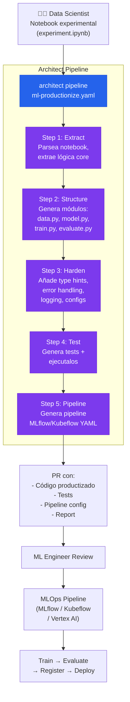

# ML Experiment Accelerator

> Notebook experimental → pipeline de 5 pasos → código producción con tests y config MLflow.

## El problema

El 85% de modelos ML nunca llegan a producción. Un factor clave: el gap entre el notebook del data scientist y el código production-ready que necesita el pipeline MLOps. El data scientist sabe qué modelo quiere pero no siempre escribe código productizable: sin tests, sin type hints, sin manejo de errores, sin logging, con hyperparams hardcodeados.

## Dónde encaja architect

Architect como **traductor de notebooks a código producción**. El pipeline toma el notebook experimental, genera código limpio siguiendo las convenciones MLOps del equipo (definidas en `.architect.md`), genera tests, y valida que el training pipeline funcione.

## Diagrama



## Implementación

### Pipeline YAML

```yaml
# ml-productionize.yaml
name: ml-productionize
steps:
  - name: extract
    agent: build
    task: >
      Parsea experiment.ipynb (formato nbformat JSON).
      Identifica: imports, data loading, preprocessing,
      model definition, training loop, evaluation metrics.
      Ignora: exploratory cells, visualizations, markdown.
      Escribe un resumen en EXTRACTION_PLAN.md.

  - name: structure
    agent: build
    task: >
      Siguiendo EXTRACTION_PLAN.md, genera módulos Python:
      - src/data/loader.py (data loading + preprocessing)
      - src/models/model.py (model definition)
      - src/training/train.py (training loop con MLflow tracking)
      - src/evaluation/evaluate.py (metrics + evaluation)
      - configs/default.yaml (hyperparams externalizados)

  - name: harden
    agent: build
    task: >
      Añade a todos los módulos generados:
      - Type hints en todas las funciones
      - Docstrings Google-style
      - Logging con structlog (reemplaza prints)
      - Error handling (try/except con mensajes útiles)
      - Seed reproducibility (torch/numpy/random)
      Externaliza TODO hyperparameter a configs/default.yaml.

  - name: test
    agent: build
    task: >
      Genera tests/test_data.py, tests/test_model.py, tests/test_training.py.
      Los tests deben verificar: shapes de datos, forward pass del modelo,
      que el training loop reduce loss en 5 steps.
      Ejecuta pytest para verificar que todos pasan.

  - name: pipeline-config
    agent: build
    task: >
      Genera configs/mlflow_pipeline.yaml con la configuración
      para ejecutar el training como job de MLflow:
      entry_points, parameters, metrics, artifacts.
      Genera también un Makefile con targets: train, evaluate, test.
```

### .architect.md para ML

```markdown
# ML Code Conventions

## Estructura
- src/data/ → data loading, preprocessing, feature engineering
- src/models/ → model definitions
- src/training/ → training loops, callbacks
- src/evaluation/ → metrics, evaluation logic
- configs/ → hydra/omegaconf configs
- tests/ → pytest tests

## Obligatorio
- Type hints en todas las funciones públicas
- Docstrings Google-style con Args/Returns/Raises
- Logging con structlog (no print)
- Configs externalizadas (no hardcoded hyperparams)
- Seed reproducibility (torch.manual_seed, np.random.seed)
- MLflow tracking en training loop (log_params, log_metrics, log_model)

## Prohibido
- No imports con * (from x import *)
- No paths absolutos
- No credenciales en código
- No dependencias sin versión fija en requirements.txt
- No globals mutables
```

### Configuración

```yaml
# .architect.yaml
llm:
  model: openai/gpt-4.1
  api_key_env: OPENAI_API_KEY

guardrails:
  protected_files:
    - "experiment.ipynb"   # No modificar el notebook original
    - "data/**"            # No tocar datos
    - "*.csv"
    - "*.parquet"
  code_rules:
    - pattern: 'from .* import \*'
      message: "No wildcard imports"
      severity: block
    - pattern: 'print\('
      message: "Usa structlog en vez de print"
      severity: warn
```

## Features de architect usadas

| Feature | Rol en esta arquitectura |
|---------|------------------------|
| **Pipeline** | 5 pasos secuenciales: extract → structure → harden → test → config |
| **Sub-agents** | Diferentes agentes para generación vs testing |
| **.architect.md** | Convenciones ML del equipo (estructura, logging, configs) |
| **Guardrails** | Protege notebook original y datos |
| **code_rules** | Bloquea wildcards imports, warns en prints |
| **Reports** | Documentación de qué se generó y resultados de tests |

## Resultado

De un notebook de 200 celdas, architect genera:
- 4-6 módulos Python limpios con type hints y docstrings
- Tests unitarios que verifican shapes, forward pass, y convergencia
- Config YAML con hyperparams externalizados
- Pipeline config para MLflow/Kubeflow
- Makefile con targets estándar

El ML Engineer revisa el PR y lo conecta al pipeline MLOps existente. El gap de "semanas de productización" se reduce a "horas de review".
