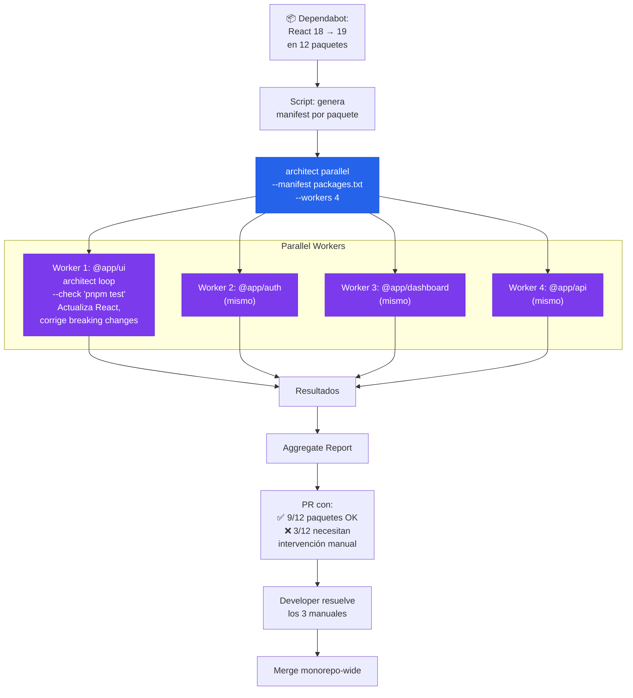

# Monorepo Dependency Updater

> React 18→19 en 12 paquetes. Parallel workers actualizan cada paquete con Ralph Loop.

## El problema

Monorepos con 10-50 paquetes. Una actualización de dependencia (TypeScript 5.5→5.6, React 18→19, Node 18→22) necesita aplicarse en todos los paquetes, cada uno con sus peculiaridades. Renovate y Dependabot crean PRs pero no arreglan breaking changes. El resultado: 12 PRs abiertos, cada uno necesitando intervención manual.

## Dónde encaja architect

**Parallel runs por paquete**: cada worker actualiza la dependencia en su paquete, ejecuta Ralph Loop hasta que los tests pasen, y reporta. El resultado es un PR agregado con todos los paquetes que migraron correctamente, y un report de los que necesitan intervención manual.

## Diagrama



## Implementación

### Script de orquestación

```bash
#!/bin/bash
# update-dependency.sh

DEPENDENCY=$1   # e.g., "react"
FROM_VERSION=$2 # e.g., "18"
TO_VERSION=$3   # e.g., "19"

# 1. Encontrar paquetes que usan la dependencia
find packages/ -name "package.json" \
  -exec grep -l "\"$DEPENDENCY\"" {} \; \
  | sed 's|/package.json||' \
  > packages-to-update.txt

echo "$(wc -l < packages-to-update.txt) paquetes a actualizar"

# 2. Parallel update con Ralph Loop por paquete
architect parallel \
  "Actualiza $DEPENDENCY de v$FROM_VERSION a v$TO_VERSION en este paquete. \
   Primero actualiza package.json. Luego ejecuta los tests. \
   Si hay breaking changes, corrígelos siguiendo la migration guide oficial. \
   Sigue las reglas de .architect.md." \
  --manifest packages-to-update.txt \
  --workers 4 \
  --config .architect.yaml \
  --confirm-mode yolo

# 3. Generar report
echo "=== Resultados ==="
for pkg in $(cat packages-to-update.txt); do
  if [ -f "$pkg/.architect-result.json" ]; then
    echo "✅ $pkg"
  else
    echo "❌ $pkg — necesita intervención manual"
  fi
done
```

### Configuración

```yaml
# .architect.yaml
llm:
  model: openai/gpt-4.1
  api_key_env: OPENAI_API_KEY

guardrails:
  protected_files:
    - "pnpm-lock.yaml"     # El lock lo regenera pnpm, no el agente
    - "pnpm-workspace.yaml"
    - ".github/**"
    - "turbo.json"
  max_files_modified: 10   # Por paquete

costs:
  budget_usd: 0.50  # Por paquete
```

### .architect.md para updates

```markdown
# Dependency Update Rules

## Proceso
1. Actualizar versión en package.json
2. Ejecutar pnpm install
3. Ejecutar pnpm test para detectar breaking changes
4. Si hay breaking changes, consultar MIGRATION.md (si existe)
5. Corregir cada breaking change
6. Re-ejecutar tests hasta que pasen

## Obligatorio
- No cambiar APIs públicas del paquete
- No actualizar dependencias no solicitadas
- Mantener compatibilidad con otros paquetes del monorepo

## Prohibido
- No ejecutar pnpm install --no-frozen-lockfile
- No eliminar tests que fallan
- No ignorar errores de TypeScript con @ts-ignore
```

## Features de architect usadas

| Feature | Rol en esta arquitectura |
|---------|------------------------|
| **Parallel** | N paquetes procesados simultáneamente en worktrees |
| **Ralph Loop** | Por paquete: update→test→fix breaking changes→retest |
| **Guardrails** | Protege lockfile, workspace config, CI configs |
| **.architect.md** | Reglas de actualización (no romper APIs, no @ts-ignore) |
| **Reports** | Resultado por paquete: éxito, fallo, parcial |
| **Budget** | $0.50 por paquete evita costes descontrolados |

## Valor

- **Sin architect**: 12 PRs de Dependabot x 30min de fix manual = 6h de trabajo
- **Con architect**: 1 comando, 9/12 paquetes actualizados automáticamente, 3 con report de qué falla para fix manual. Tiempo total: 15min de review.
