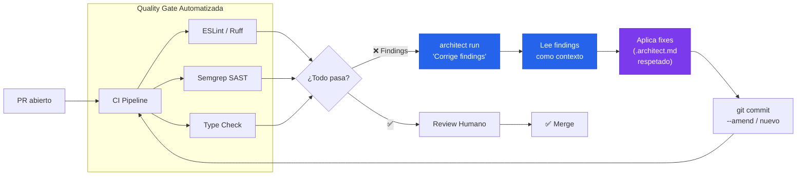

# PR Quality Gate + Auto-Remediation

> Linters y SAST detectan findings → architect aplica fixes → pushea al mismo PR.

## El problema

Los equipos usan ESLint, Ruff, Semgrep, y type checkers en PRs. Cuando fallan, el developer interpreta el error, arregla, pushea, espera que el CI corra de nuevo. Un ciclo de 3-5 iteraciones solo para pasar la quality gate. Multiplicado por 10 PRs al día, son horas perdidas en trabajo mecánico.

## Dónde encaja architect

Architect se posiciona **después del scanner y antes del review humano**. Lee los findings, aplica fixes respetando los guardrails y convenciones del proyecto, y pushea un commit de remediación al mismo PR. El developer solo revisa el fix — no lo implementa.

## Diagrama



## Implementación

### GitHub Actions workflow

```yaml
# .github/workflows/quality-gate.yml
name: Quality Gate + Auto-Fix
on: [pull_request]

jobs:
  lint:
    runs-on: ubuntu-latest
    steps:
      - uses: actions/checkout@v4
        with:
          ref: ${{ github.head_ref }}

      - name: Run linters
        id: lint
        run: |
          ruff check src/ --output-format json > findings.json 2>&1 || true
          semgrep --json -o semgrep-findings.json . || true
        continue-on-error: true

      - name: Auto-fix con architect
        if: steps.lint.outcome == 'failure'
        run: |
          architect run "Corrige todos los findings de los archivos \
            findings.json y semgrep-findings.json. \
            No cambies lógica de negocio. Solo aplica fixes \
            de lint y seguridad." \
            --config .architect.yaml \
            --confirm-mode yolo \
            --report-file fix-report.json
        env:
          OPENAI_API_KEY: ${{ secrets.LLM_KEY }}

      - name: Push fix
        run: |
          git add -A
          git commit -m "fix: auto-remediation via architect" || exit 0
          git push
```

### Configuración con code_rules

```yaml
# .architect.yaml
llm:
  model: openai/gpt-4.1
  api_key_env: OPENAI_API_KEY

guardrails:
  protected_files:
    - "*.env*"
    - "*.pem"
    - "Dockerfile"
    - "docker-compose.yml"
    - ".github/**"
  max_files_modified: 15
  code_rules:
    - pattern: 'eval\('
      message: "eval() prohibido — usa alternativa segura"
      severity: block
    - pattern: 'dangerouslySetInnerHTML'
      message: "XSS risk — usa sanitización"
      severity: block
    - pattern: 'innerHTML\s*='
      message: "XSS risk — usa textContent o sanitización"
      severity: warn

hooks:
  post_tool_use:
    - name: auto-format
      command: "ruff format $CLIA_FILE_PATH 2>/dev/null || true"
```

## Features de architect usadas

| Feature | Rol en esta arquitectura |
|---------|------------------------|
| **run** | Ejecución única: lee findings, aplica fixes |
| **Guardrails** | Protege archivos sensibles, limita alcance |
| **code_rules** | Asegura que el fix no introduce nuevos problemas |
| **Hooks** | Auto-format después de cada edición |
| **.architect.md** | Convenciones del equipo (estilo, imports, patterns) |
| **Reports** | Registro de qué se cambió para el PR |

## Variante: Solo auto-format

Para equipos que solo quieren formateo automático sin fixes de lógica:

```bash
architect run "Ejecuta ruff format y ruff check --fix en todos los archivos \
  modificados de este PR. No cambies nada manualmente." \
  --confirm-mode yolo --budget 0.05
```
