# QA Bug Triage → Auto-Fix

> Bug reportado en Jira → architect lee el ticket vía MCP → intenta fix → crea PR o escala.

## El problema

El ciclo de un bug: QA lo detecta → crea ticket en Jira/Linear → developer lo lee → reproduce → debuggea → arregla → PR → review → merge. Un bug menor (typo, NPE, off-by-one) puede tardar 2-5 días en resolverse. El 60% de estos bugs son triviales y no deberían consumir ese tiempo de ciclo.

## Dónde encaja architect

Architect lee el bug report vía MCP (conectado al issue tracker), intenta el fix con Ralph Loop, y si tiene éxito, crea un PR y enlaza al ticket. El developer solo revisa el PR. Si architect no puede, comenta en el ticket con el contexto de lo que intentó para acelerar el fix manual.

## Diagrama

```mermaid
flowchart TD
    A["🐛 QA reporta bug\nen Jira/Linear"] --> B["Webhook / Cron\ndetecta ticket nuevo"]

    B --> C{"Label:\nauto-fixable?"}
    C -->|"No"| D["Cola normal\nde desarrollo"]
    C -->|"Sí"| E["architect run\nvía MCP lee ticket"]

    E --> F["MCP: read_issue\nobtiene descripción,\nsteps to reproduce"]

    F --> G["architect loop\n--check 'pytest tests/'\ncontexto: bug report"]

    G --> H{"Fix exitoso?\nTests pasan?"}
    H -->|"✅"| I["Crea PR\n+ enlaza ticket"]
    H -->|"❌"| J["Comenta en ticket:\n'Attempted auto-fix,\nneeds human'\n+ contexto del intento"]

    I --> K["Developer Review"]
    K -->|"✅ Approve"| L["Merge + Ticket\ncerrado automático"]
    K -->|"❌ Reject"| D

    style E fill:#2563eb,color:#fff,stroke:#1d4ed8
    style F fill:#f59e0b,color:#000,stroke:#d97706
    style G fill:#2563eb,color:#fff,stroke:#1d4ed8
    style J fill:#dc2626,color:#fff,stroke:#b91c1c
```



## Implementación

### Configuración MCP

```yaml
# .architect.yaml
llm:
  model: openai/gpt-4.1
  api_key_env: OPENAI_API_KEY

mcp:
  servers:
    - name: jira
      url: http://jira-mcp-bridge:8080/mcp
      auth:
        type: bearer
        token_env: JIRA_MCP_TOKEN
    - name: github
      url: http://github-mcp-bridge:8081/mcp
      auth:
        type: bearer
        token_env: GITHUB_TOKEN

guardrails:
  protected_files:
    - "*.env*"
    - "migrations/**"
    - "*.lock"
  max_files_modified: 5

costs:
  budget_usd: 0.75
```

### Script de orquestación

```bash
#!/bin/bash
# auto-fix-ticket.sh — llamado por webhook o cron

TICKET_ID=$1

# architect lee el ticket via MCP y lo intenta arreglar
architect loop \
  "Lee el ticket $TICKET_ID del Jira usando la tool MCP read_issue. \
   Entiende el bug report, reproduce el error ejecutando los tests, \
   y corrígelo. El fix debe ser mínimo y no cambiar comportamiento \
   existente." \
  --check "pytest tests/ -q" \
  --config .architect.yaml \
  --confirm-mode yolo \
  --max-iterations 5 \
  --report-file "reports/${TICKET_ID}.json"

EXIT_CODE=$?

if [ $EXIT_CODE -eq 0 ]; then
  # Éxito: crear PR
  git checkout -b "fix/${TICKET_ID}"
  git add -A
  git commit -m "fix(${TICKET_ID}): auto-fix via architect"
  git push -u origin "fix/${TICKET_ID}"
  gh pr create --title "fix(${TICKET_ID}): auto-fix" \
    --body "$(cat reports/${TICKET_ID}.json)"
else
  # Fallo: comentar en ticket con contexto
  echo "Auto-fix failed after 5 attempts. See report for details." \
    | jira-cli comment "$TICKET_ID"
fi
```

## Features de architect usadas

| Feature | Rol en esta arquitectura |
|---------|------------------------|
| **MCP** | Lee bug tickets de Jira sin scraping ni APIs custom |
| **Ralph Loop** | Itera fix→test hasta que los tests pasen |
| **Guardrails** | Limita archivos tocables y protege migrations |
| **Reports** | JSON con detalle del intento (éxito o fallo) |
| **Sessions** | Contexto persistente si se necesita reanudar |
| **Budget** | Limita coste por ticket a $0.75 |

## Criterios para label "auto-fixable"

No todos los bugs son candidatos. Buenos candidatos:
- Errores con stack trace claro (NPE, TypeError, IndexError)
- Tests que ya existen y fallan
- Bugs en lógica simple (off-by-one, condición invertida)
- Typos en strings, mensajes, o configuración

Malos candidatos:
- Bugs de diseño o arquitectura
- Race conditions
- Bugs sin tests que lo reproduzcan
- Problemas de performance
