# Security Vulnerability Remediation Pipeline

> Scanner detecta CVEs → pipeline de 4 pasos analiza, corrige, re-escanea, y documenta.

## El problema

Semgrep, Snyk, CodeQL o Dependabot detectan vulnerabilidades pero no las arreglan (o generan fixes básicos que requieren revisión). El gap entre "vulnerabilidad detectada" y "fix mergeado" puede ser semanas. Con el EU AI Act entrando en vigor agosto 2026 y sus ventanas de reporte de incidentes de 72h/15d, ese gap es inaceptable.

## Dónde encaja architect

Architect como **pipeline de remediación de 4 pasos**: analyze → fix → verify → document. El pipeline mode orquesta la secuencia. Los guardrails aseguran que el fix no introduce nuevos problemas. El report documenta todo para compliance.

## Diagrama

```mermaid
flowchart TD
    A["🔍 Security Scanner\n(Semgrep / Snyk / CodeQL)"] --> B["Findings JSON\n(CVEs, CWEs)"]

    B --> C["architect pipeline\nsecurity-remediation.yaml"]

    subgraph architect_pipeline["Architect Pipeline"]
        direction TB
        C --> D["Step 1: Analyze\nLee findings,\nprioriza por severidad"]
        D --> E["Step 2: Fix\narchitect loop\n--check 'semgrep --error'"]
        E --> F["Step 3: Verify\nRe-scan completo"]
        F --> G["Step 4: Document\nGenera changelog\nde seguridad"]
    end

    G --> H{"Re-scan\nlimpio?"}
    H -->|"✅"| I["PR con fix +\nreport compliance"]
    H -->|"❌"| J["Escala a\nSecurity Team"]

    I --> K["Security Review"]
    K --> L["✅ Merge"]

    style C fill:#2563eb,color:#fff,stroke:#1d4ed8
    style D fill:#7c3aed,color:#fff,stroke:#6d28d9
    style E fill:#7c3aed,color:#fff,stroke:#6d28d9
    style F fill:#7c3aed,color:#fff,stroke:#6d28d9
    style G fill:#7c3aed,color:#fff,stroke:#6d28d9
    style J fill:#dc2626,color:#fff,stroke:#b91c1c
```



## Implementación

### Pipeline YAML

```yaml
# security-remediation.yaml
name: security-fix
steps:
  - name: analyze
    agent: build
    task: >
      Lee el archivo findings.json con los hallazgos de seguridad.
      Prioriza: CRITICAL > HIGH > MEDIUM. Ignora LOW.
      Crea un plan de remediación en REMEDIATION_PLAN.md con:
      - Cada vulnerabilidad (CVE ID, severidad, archivo afectado)
      - Fix propuesto para cada una
      - Orden de aplicación (dependencias primero)

  - name: fix
    agent: build
    task: >
      Ejecuta el plan de REMEDIATION_PLAN.md.
      Corrige cada vulnerabilidad sin cambiar comportamiento funcional.
      Ejecuta los tests existentes después de cada fix para verificar
      que no hay regresiones.

  - name: verify
    agent: build
    task: >
      Ejecuta semgrep con las mismas reglas del scan original.
      Verifica que los findings CRITICAL y HIGH están resueltos.
      Si quedan findings, documéntalos con justificación.

  - name: document
    agent: build
    task: >
      Crea SECURITY_CHANGELOG.md con:
      - Vulnerabilidades corregidas (CVE ID, severidad, fix aplicado)
      - Vulnerabilidades no corregidas (justificación)
      - Tests ejecutados y resultado
      - Timestamp y versión de las reglas del scanner
```

### Ejecución

```bash
# 1. Scan
semgrep --json -o findings.json --config p/owasp-top-ten .

# 2. Remediation pipeline
architect pipeline security-remediation.yaml \
  --config .architect.yaml \
  --confirm-mode yolo \
  --budget 2.00

# 3. Verificar y crear PR
git checkout -b security/auto-remediation
git add -A
git commit -m "fix(security): automated vulnerability remediation"
git push -u origin security/auto-remediation
```

### Guardrails de seguridad

```yaml
guardrails:
  protected_files:
    - "*.env*"
    - "*.pem"
    - "*.key"
    - "migrations/**"
    - ".github/**"
  max_files_modified: 20
  code_rules:
    - pattern: 'eval\('
      severity: block
    - pattern: 'exec\('
      severity: block
    - pattern: 'subprocess\.call\('
      message: "Usa subprocess.run con check=True"
      severity: warn
    - pattern: 'pickle\.loads?\('
      message: "Deserialización insegura — usa json"
      severity: block
  blocked_commands:
    - "rm -rf"
    - "curl | sh"
    - "wget | bash"
```

## Features de architect usadas

| Feature | Rol en esta arquitectura |
|---------|------------------------|
| **Pipeline** | Orquesta los 4 pasos en secuencia |
| **Ralph Loop** | Dentro del step "fix": itera hasta que semgrep pase |
| **Guardrails** | Impide que el fix toque migrations, secrets, o CI configs |
| **code_rules** | Bloquea patrones inseguros en el propio fix |
| **Reports** | SECURITY_CHANGELOG.md como evidencia para compliance |
| **Hooks** | Auto-lint después de cada edición |

## Valor para compliance

El output de esta arquitectura genera artefactos directamente útiles para:

- **OWASP Agentic Top 10**: Evidencia de mitigación automatizada con guardrails
- **EU AI Act Article 26**: Audit trail de remediación con timestamps
- **SOC 2**: Registro de cambios de seguridad con trazabilidad
