# Self-Healing CI/CD Pipeline

> Tests fallan en CI → architect los arregla automáticamente → crea PR con el fix.

## El problema

El patrón más frustrante de CI/CD: un developer pushea, los tests fallan por un edge case, y el pipeline se bloquea esperando atención humana. A las 3am nadie está mirando. A las 9am hay 5 PRs bloqueados y el equipo empieza el día resolviendo tests rotos en vez de construir features.

En 2026 esto tiene nombre: el **"Pipeline Doctor" o "Interceptor pattern"**. Un fallo no es una señal de stop — es un trigger para un agente de reparación. GitHub, GitLab y las principales plataformas están convergiendo hacia este modelo.

## Dónde encaja architect

Architect se posiciona como el **Repair Agent** entre el fallo de tests y la creación de un PR con el fix. Su Ralph Loop es exactamente el primitivo que este patrón necesita: fix→test→verify en bucle hasta que pase o se agote el budget.

## Diagrama

```mermaid
flowchart TD
    A["👨‍💻 Developer Push"] --> B["GitHub Actions / GitLab CI"]
    B --> C{"🧪 Tests"}
    C -->|"✅ Pass"| D["Deploy / Merge"]
    C -->|"❌ Fail"| E["architect loop\n--check 'pytest'\n--budget 0.50"]

    E --> F{"Ralph Loop"}
    F --> G["LLM analiza\nerror logs"]
    G --> H["Aplica fix\n(guardrails activos)"]
    H --> I{"pytest pasa?"}
    I -->|"❌ No"| G
    I -->|"✅ Sí"| J["Genera report JSON"]

    J --> K["git commit + push\nnueva branch"]
    K --> L["Crea PR automático\ncon report adjunto"]
    L --> M["👨‍💻 Code Review humano"]
    M --> D

    F -->|"Budget agotado\no max_iterations"| N["❌ Escalación\nNotifica equipo"]

    style E fill:#2563eb,color:#fff,stroke:#1d4ed8
    style F fill:#2563eb,color:#fff,stroke:#1d4ed8
    style H fill:#7c3aed,color:#fff,stroke:#6d28d9
    style J fill:#059669,color:#fff,stroke:#047857
    style N fill:#dc2626,color:#fff,stroke:#b91c1c
```



## Implementación

### GitHub Actions workflow

```yaml
# .github/workflows/self-healing.yml
name: Self-Healing Tests
on: [push, pull_request]

jobs:
  test:
    runs-on: ubuntu-latest
    steps:
      - uses: actions/checkout@v4
      - uses: actions/setup-python@v5
        with:
          python-version: '3.12'

      - name: Run tests
        id: tests
        run: pytest tests/ -q
        continue-on-error: true

      - name: Auto-fix con architect
        if: steps.tests.outcome == 'failure'
        run: |
          pip install architect-ai-cli
          architect loop "Corrige los tests que fallan. \
            Lee el output de pytest para entender qué falla \
            y aplica el fix mínimo necesario." \
            --check "pytest tests/ -q" \
            --config .architect.yaml \
            --confirm-mode yolo \
            --budget 0.50 \
            --max-iterations 5 \
            --report-file fix-report.json \
            --exit-code-on-partial 1
        env:
          OPENAI_API_KEY: ${{ secrets.LLM_KEY }}

      - name: Crear PR con fix
        if: steps.tests.outcome == 'failure' && success()
        uses: peter-evans/create-pull-request@v6
        with:
          title: "[architect] Auto-fix: tests corregidos"
          body-path: fix-report.json
          branch: architect/auto-fix-${{ github.sha }}
          commit-message: "fix: auto-remediation via architect Ralph Loop"
```

### Configuración architect

```yaml
# .architect.yaml
llm:
  model: openai/gpt-4.1
  api_base: https://api.openai.com/v1
  api_key_env: OPENAI_API_KEY

guardrails:
  protected_files:
    - ".env"
    - "*.pem"
    - "*.key"
    - "docker-compose.yml"
    - "Dockerfile"
    - ".github/**"
  max_files_modified: 10
  code_rules:
    - pattern: 'eval\('
      severity: block
    - pattern: 'exec\('
      severity: block

costs:
  budget_usd: 0.50
```

## Features de architect usadas

| Feature | Rol en esta arquitectura |
|---------|------------------------|
| **Ralph Loop** | Core: ciclo fix→test→verify hasta que pytest pase |
| **Guardrails** | Protege archivos de CI/CD, secrets, y Dockerfiles |
| **Budget** | Hard limit para evitar costes descontrolados a las 3am |
| **Reports** | JSON adjunto al PR como evidencia de qué se cambió |
| **Exit codes** | `--exit-code-on-partial` para que el CI sepa si fue exitoso |
| **.architect.md** | Convenciones del proyecto respetadas en el fix |

## Flujo de escalación

Si architect no puede arreglar los tests (budget agotado o max_iterations alcanzado), el workflow debe escalar:

```yaml
      - name: Notificar fallo
        if: steps.tests.outcome == 'failure' && failure()
        uses: slackapi/slack-github-action@v1
        with:
          payload: |
            {
              "text": "⚠️ Auto-fix falló en ${{ github.repository }}. Tests siguen rotos después de 5 intentos ($0.50 budget). Necesita intervención manual.",
              "blocks": [...]
            }
```

## Valor diferencial

Sin architect, implementar este patrón requiere:
- Loop de reintentos custom
- Parsing de errores de pytest
- Ejecución segura de código con sandboxing
- Tracking de costes por iteración
- Límites de iteraciones con fallback
- Generación de reports para el PR

Architect lo empaqueta en **un solo comando** con guardrails incluidos. El workflow de GitHub Actions pasa de ~100 líneas de script custom a ~15 líneas.
